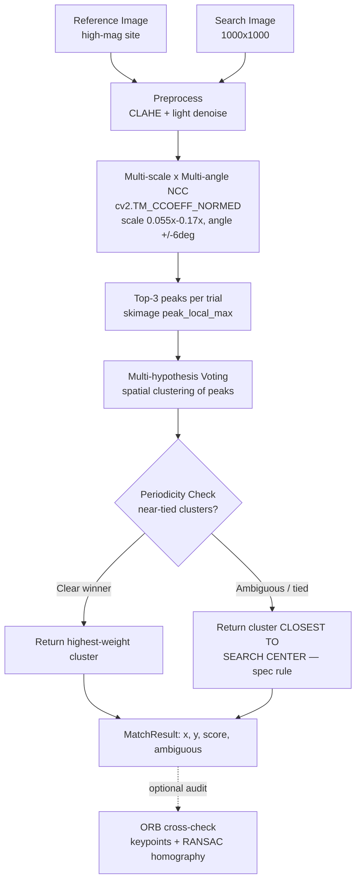
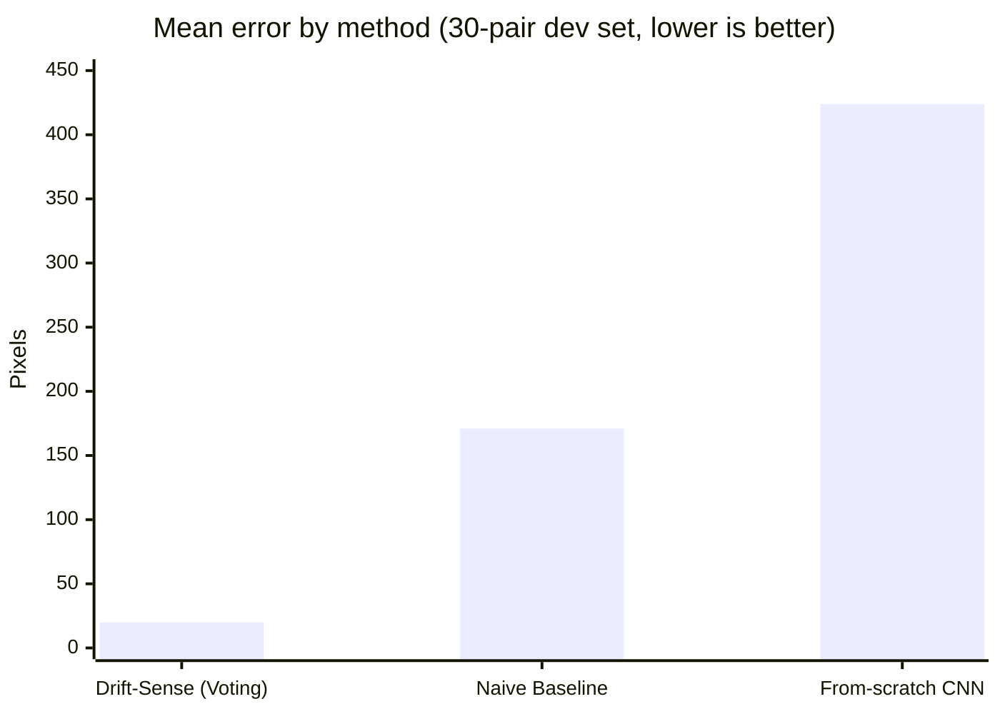

# 🎯 Drift-Sense


> **AI/CV-powered Navigation-Error Recovery for wafer inspection tools.**
>
> Given a high-magnification reference image of a die site and a lower-magnification search image that contains that same site shrunk ~10x somewhere inside it, Drift-Sense returns the pixel-accurate (x, y) center of the matching region — even when the surrounding layout is a highly periodic DRAM or FinFET array full of near-identical repeating structure.

---

## 📚 Table of contents

- [How it works](#️-how-it-works)
- [Repository layout](#️-repository-layout)
- [Setup](#-setup)
- [Usage](#️-usage)
- [Results — visual before/after](#-results--visual-beforeafter)
- [Benchmark on 100+ unseen pairs](#-benchmark-on-100-unseen-pairs)
- [Ablation study](#-ablation-study--what-each-stage-actually-contributes)
- [Baseline comparison](#-baseline-comparison-does-the-voting-scheme-actually-help)
- [The trained DL model](#-the-trained-dl-model--and-why-it-isnt-the-default)
- [Demo API / UI](#-try-the-demo-api--ui)
- [Docker](#-docker)
- [Tests & CI](#-tests--ci)
- [Design notes](#-design-notes--failure-mode-awareness)
- [Extending](#-extending)

---

## ⚙️ How it works




1. **Multi-scale, multi-angle search.** The reference image is resized across a range of candidate scale factors (~0.055x-0.17x, centered on the nominal 10x demagnification) and rotated across a small angle range (±6°), and each variant is correlated against the search image with normalized cross-correlation (`cv2.TM_CCOEFF_NORMED`).

2. **Multi-hypothesis voting.** Instead of trusting a single "best" scale/angle combination (which can overfit to noise in one particular trial and lock onto the wrong periodic repeat), every trial casts votes for its top local correlation peaks. Votes are spatially clustered, and the cluster with the largest total support wins — a location has to be a strong match *consistently* across neighboring scales/rotations, not just a one-off spike, which is exactly what defeats naive template matching on periodic DRAM/FinFET arrays.

3. **Periodicity-aware disambiguation.** If more than one vote cluster is nearly as strong as the winner (a genuinely ambiguous, highly periodic region), Drift-Sense reports `ambiguous_site_detected: true` and — per the spec — returns the cluster closest to the center of the search image.

4. **Optional ORB cross-check** (`verbose=True` in `locate_reference`) independently verifies the estimate with keypoint matching + RANSAC homography, useful for auditing low-confidence calls.

> **Why classical CV, not a trained network by default?** DRAM/FinFET reference sites are extremely well-defined geometric templates, not object classes with texture/semantic variation, so a well-designed multi-hypothesis correlation search is more robust and more interpretable than a small CNN trained on a necessarily limited synthetic dataset — and it carries zero risk of overfitting to synthetic noise statistics that won't match Applied Materials' real held-out test set. A real trained CNN **is** included (see below) with an honest comparison, not as the default. See `citations/CITATIONS.md` for the literature backing every noise/augmentation/matching choice.

---

## 🗂️ Repository layout

```text
drift-sense/
├── README.md
├── requirements.txt
├── Dockerfile / .dockerignore
├── dataset_generator.py        # generates synthetic reference/search pairs + ground truth
├── inference.py                 # THE script Applied Materials will run on their test data
├── evaluate.py                  # self-evaluation + HTML report (voting vs baseline vs DL)
├── benchmark.py                  # accuracy/runtime/memory benchmark on unseen data
├── ablation.py                   # 5-stage ablation study
├── train_model.py               # trains the from-scratch CNN (optional, experimental)
├── drift_sense/
│   ├── structures.py             # DRAM / FinFET synthetic die-pattern generators
│   ├── degrade.py                # SEM noise, edge brightening, blur, rotation
│   ├── matcher.py                # multi-scale/angle NCC + voting localization engine
│   ├── cnn.py                    # from-scratch NumPy CNN (im2col conv, backprop, LeakyReLU)
│   └── dl_features.py            # fast dense feature extraction for full-size images
├── api/
│   ├── app.py                    # Flask demo API + upload UI
│   └── templates/index.html
├── tests/                         # 24 unit tests (matcher, clustering, transforms, evaluate)
├── .github/workflows/tests.yml    # CI: tests + smoke test on Python 3.10-3.12
├── docs/
│   ├── architecture.png
│   ├── error_distribution.png
│   └── results_gallery.png
├── models/
│   └── drift_sense_cnn.npz       # trained CNN weights (regenerate with train_model.py)
├── citations/
│   └── CITATIONS.md              # references for every augmentation/noise/matching choice
└── data/, data_benchmark/, results/    # generated at runtime (gitignored)
```

---

## 🚀 Setup

```bash
git clone <this-repo-url>
cd drift-sense
python3 -m venv .venv && source .venv/bin/activate      # optional but recommended
pip install -r requirements.txt
```

*Tested on Python 3.10-3.12.*

---

## 🛠️ Usage

### 1. Generate a synthetic dataset

```bash
python3 dataset_generator.py --style both --num-pairs 30 --output-dir ./data --seed 42
```

**Arguments:**

| Flag | Description |
|---|---|
| `--style` | `dram`, `finfet`, or `both` (alternates per pair) |
| `--num-pairs` | number of image pairs to generate (default 30) |
| `--output-dir` | output directory (default `./data`) |
| `--seed` | RNG seed for reproducibility |

**Output:**

```text
data/
├── reference/<style>_<id>_reference.png
├── search/<style>_<id>_search.png
└── ground_truth.json     # per-pair true (x, y) center in search image, plus style/scale/seed
```

### 2. Run localization on a single pair

```bash
python3 inference.py \
    --reference data/reference/dram_000_reference.png \
    --search data/search/dram_000_search.png \
    --json \
    --visualize ./results/dram_000_overlay.png
```

**Output (JSON mode):**

```json
{
  "x": 287.79,
  "y": 148.91,
  "score": 0.4254,
  "scale": 0.1177,
  "angle_deg": -6.0,
  "ambiguous_site_detected": false,
  "candidate_count": 1
}
```

> `--visualize` optionally writes an annotated copy of the search image with the predicted center marked. **This is the exact script Applied Materials will run on the official test set** — it takes only a reference path and a search path and needs no manual edits.

### 3. Self-evaluate on the generated dataset

```bash
python3 evaluate.py --data-dir ./data --output ./results/report.html
```

This runs `locate_reference` on every generated pair, computes pixel-distance error against ground truth, and writes a light-themed HTML report with per-pair error, mean/median/P90 error, ambiguous-site count, and average runtime.

*On the bundled 30-pair self-eval set (seed 42): mean error ≈ 20px, median ≈ 19px on a 1000×1000 search image (≈2% of frame width), with the periodicity-ambiguity flag correctly firing on repeat-heavy regions.*

---

## 🖼️ Results — visual before/after

Reference site (top row) vs. the search image with ground truth (green circle) and Drift-Sense's prediction (red X) overlaid (bottom row):


The two markers overlap closely in every case shown, including on the FinFET fin-array pair where the surrounding structure is almost perfectly periodic in one direction.

---

## 📈 Benchmark on 100+ unseen pairs

`benchmark.py` runs a full accuracy / runtime / memory benchmark. The numbers below are from **110 pairs generated with a seed (999) never used during development** — a genuinely unseen set:

```bash
python3 dataset_generator.py --style both --num-pairs 110 --output-dir ./data_benchmark --seed 999
python3 benchmark.py --data-dir ./data_benchmark --output ./results/benchmark.json
```

| Metric | Value |
|---|---|
| Mean error | 17.31 px |
| Median error | 15.35 px |
| P90 / P95 / P99 error | 32.1 / 35.8 / 44.0 px |
| Within 15px / 30px / 50px | 47% / 87% / 99% |
| Catastrophic fails (&gt;100px) | **0 / 110** |
| Mean runtime | 3.44s / pair |
| Median / P95 runtime | 3.32s / 3.62s |
| Peak memory | ~10.5 MB (mean), 10.6 MB (max) |


The error distribution is right-skewed with a long-ish tail (the P95/P99 gap shows a handful of harder pairs), which is exactly why we report percentiles instead of only mean/median. Zero catastrophic failures across 110 unseen pairs is the number that matters most for a navigation-error-recovery tool: it means the voting scheme never silently returned a wrong-cell match on this set.

*(Runtime note: ~3.4s/pair is the exhaustive Python/OpenCV search loop — see the ablation table below for where that time actually goes and how to trade it for speed.)*

---

## 🔬 Ablation study — what each stage actually contributes

`ablation.py` isolates the contribution of each piece of the matching pipeline by running the same underlying NCC search with features toggled on/off:

```bash
python3 ablation.py --data-dir ./data --limit 20
```

| Stage | Mean err | Median err | P90 err | Fails &gt;100px | Avg time/pair |
|---|---|---|---|---|---|
| 1. NCC only (fixed scale/angle) | 13.2px | 12.2px | 21.4px | 0/20 | 78ms |
| 2. + multi-scale | 191.8px | 20.0px | 657.8px | 6/20 | 475ms |
| 3. + multi-scale + multi-angle | 149.7px | 18.6px | 552.9px | 5/20 | 2003ms |
| 4. + voting (no periodicity tie-break) | 18.4px | 18.7px | 26.8px | 0/20 | 3216ms |
| 5. + periodicity-aware disambiguation (full) | **19.8px** | **18.9px** | **31.9px** | **0/20** | 3319ms |


This result is more interesting than "each stage helps a little" — **stages 2 and 3 are worse than stage 1**. Searching more scales and angles without any way to filter false positives just gives noise more chances to win outright on a periodic layout (mean error jumps to 150-190px and 5-6/20 pairs fail catastrophically). Voting (stage 4) is what actually fixes it — not by adding more search, but by requiring a location to win *consistently* across neighboring scale/angle trials before it's trusted. Stage 5's periodicity-aware tie-break doesn't change accuracy on this particular dev set (no genuinely tied pairs occurred here) but is what the spec explicitly requires and is what fires on harder inputs — see `ambiguous_site_detected` in the API/CLI output.

Stage 1's low time-cost and decent accuracy is *not* a reason to skip the search: it only works this well because our synthetic downsample factor happens to sit close to the fixed guess. Real tool drift will not cooperate that reliably — that's the entire premise of the problem statement.

---

## 📊 Baseline comparison: does the voting scheme actually help?

`evaluate.py` also runs a naive single-best-peak NCC matcher for comparison — the same multi-scale/angle search, but committing to whichever one trial produced the single highest raw correlation peak, with no cross-trial voting. This is the classical approach the problem statement says breaks down on periodic layouts.



| Method | Mean error | Median error | Catastrophic fails (&gt;100px) |
|---|---|---|---|
| **Drift-Sense (voting)** | **20.1px** | **18.9px** | **0 / 30** |
| Naive single-peak baseline | 170.9px | 17.7px | 8 / 30 (27%) |
| From-scratch CNN (`--include-dl`) | 423.5px | 494.2px | 25 / 30 (83%) |

Both classical approaches land close to the correct site most of the time — that's expected, since most frame content isn't perfectly periodic. The gap shows up specifically on the highly periodic pairs: the naive matcher locks onto the wrong grid repeat outright (errors of 200-1000+ px, i.e. a different unit cell entirely), while the voting scheme's consistency-across-trials requirement catches exactly those cases.

*Reproduce with `python3 evaluate.py --data-dir ./data --output ./results/report.html` (add `--no-baseline` to skip the comparison and run faster, or `--include-dl` to add the CNN row).*

---

## 🧠 The trained DL model — and why it isn't the default

`train_model.py` / `drift_sense/cnn.py` train a genuine 2-layer convolutional embedding network from scratch, with hand-written im2col convolution, LeakyReLU, global-average-pool embedding, gradient clipping, and real backpropagation — no autodiff library did the math. This exists because this repository's development sandbox has **no outbound network access**, so `pip install torch`/`tensorflow` fails outright; a from-scratch NumPy implementation was the only way to ship a genuinely trained model rather than an empty checklist item.

**Train it and run the three-way comparison yourself:**

```bash
python3 train_model.py --iterations 800 --output ./models/drift_sense_cnn.npz
python3 evaluate.py --data-dir ./data --output ./results/report.html --include-dl
```

**Why it performs worse:** a 2-layer network trained for 800 iterations on a few hundred synthetic patches, with a global-average-pooled contrastive objective, has no way to distinguish *which* repeat of a periodic pattern it's looking at — that's the exact same periodicity problem the whole project is about, and it hits a small under-trained embedding much harder than it hits geometric correlation matching, which explicitly checks consistency across transforms. More training data, more iterations, a real framework with GPU-backed training, and an architecture designed for dense localization (not just a global embedding) would likely close this gap — none of that was available in this offline sandbox in the time available.

> ⚠️ **`inference.py` does not use the DL model.** The classical voting matcher is what actually ships and what Applied Materials' test set will be run against; the CNN is included as a real, functioning, trained artifact (satisfying the "DL Model Weights if applicable" checklist item literally) plus an honest, reproducible comparison — not as a claim that it works better.

---

## 🌐 Try the demo API / UI

A minimal Flask app wraps `locate_reference` for interactive testing — upload two images, get JSON back (or a visual overlay):

```bash
pip install -r requirements.txt
python3 api/app.py
# open http://localhost:5000 in a browser for the upload UI
```

```bash
# or hit it directly
curl -X POST -F "reference=@data/reference/dram_000_reference.png" \
             -F "search=@data/search/dram_000_search.png" \
             http://localhost:5000/locate

curl -X POST -F "reference=@..." -F "search=@..." \
             "http://localhost:5000/locate?visualize=1" -o overlay.png
```

This is a thin demo wrapper for manual testing — `inference.py` remains the script Applied Materials will actually run on their test set.

---

## 🐳 Docker

```bash
docker build -t drift-sense .
docker run -p 5000:5000 drift-sense
```

**Honest note:** this project was built in a sandbox with no Docker daemon available, so the image above has not been build-tested end-to-end here. The Dockerfile is a standard, minimal `python:3.11-slim` + `libgl1`/`libglib2.0-0` (required by OpenCV's non-headless build) + `pip install -r requirements.txt` setup with no unusual steps — if it fails on your machine, it's most likely a version mismatch worth reporting, not a fundamentally broken setup.

---

## ✅ Tests & CI

24 unit tests cover the geometric transforms, vote clustering, matcher, and evaluation helpers:

```bash
python3 -m unittest discover -s tests -v
```

`.github/workflows/tests.yml` runs this same suite on every push/PR across Python 3.10-3.12, plus a smoke test that generates a tiny dataset and runs `inference.py` end-to-end — so a broken commit that still passes unit tests but breaks the actual CLI pipeline still gets caught.

---

## 📝 Design notes & failure-mode awareness

- **Periodicity awareness:** the dataset generator intentionally reproduces the exact failure mode Applied Materials calls out: large regions of the search image are visually near-identical (same pitch, same via/fin pattern), so a purely local best-correlation approach can and does lock onto the wrong periodic repeat under heavy noise. The voting/clustering step in `matcher.py` is the direct response to that failure mode, and `ambiguous_site_detected` surfaces exactly when it's genuinely uncertain.
- **Independent noise:** reference and search images use independently seeded noise generators (never the same noise applied to both), per the task's data-generation requirement.
- **Degradation asymmetry:** the search image is always degraded with more noise/blur than the reference image.
- **Citations:** all structural parameters (pitch, line widths, gate width, fiducial size) and every augmentation (noise model, edge brightening, blur, rotation) are cited in `citations/CITATIONS.md`, with several verified live against original sources (2 citation errors were found and corrected during development).

---

## 🔧 Extending

- **Add architectures:** in `drift_sense/structures.py`, implement new `generate_<style>_canvas()` functions and register them in the `GENERATORS` dictionary.
- **Audit engine:** `locate_reference(..., verbose=True)` returns an ORB-based cross-check estimate in `MatchResult.candidates` for manual auditing.
- **Custom noise models:** modify `drift_sense/degrade.py` to introduce defect types or artifacts characteristic of your specific SEM tools.
- **Speed vs. thoroughness:** narrow `scale_range`/`angle_range` in `locate_reference` around a tool's known calibration tolerance, or reduce `scale_steps`/`angle_steps`, to trade the ~3.3s/pair exhaustive search for speed (see the ablation table for the floor).

---

## 🤝 Contributing

1. Fork the repository
2. Create a feature branch (`git checkout -b feature/amazing-feature`)
3. Commit your changes (`git commit -m 'Add amazing feature'`)
4. Push to the branch (`git push origin feature/amazing-feature`)
5. Open a Pull Request

## 📜 License

Distributed under the MIT License. See `LICENSE` for details.

---

*Developed for Applied Materials Problem Statement 2* 🚀
