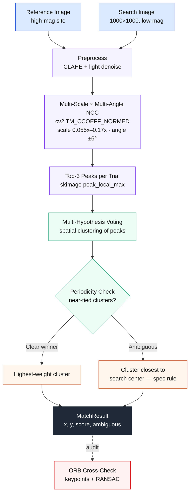
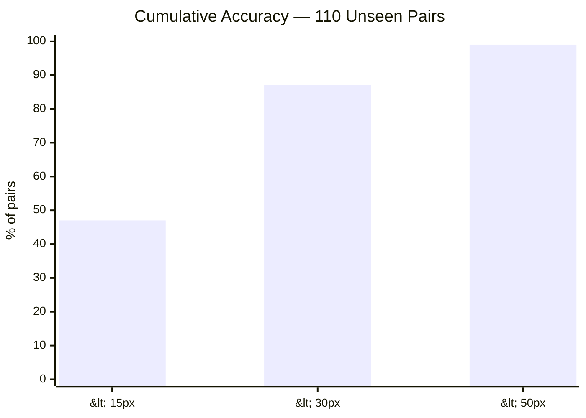
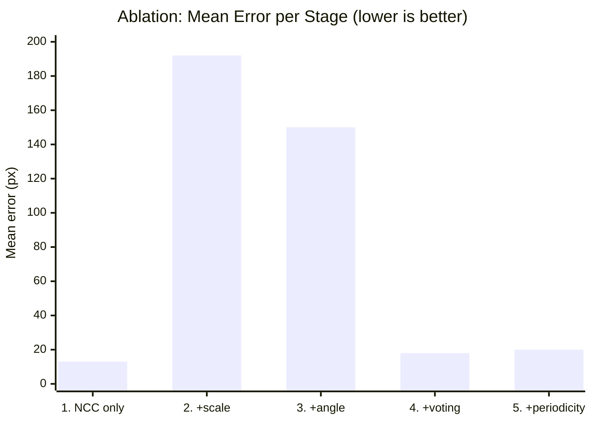

<div align="center">

# Drift-Sense

### Navigation-Error Recovery for Wafer Inspection Tools

[](https://python.org)
[](https://opencv.org)
[](https://numpy.org)
[](https://flask.palletsprojects.com)
[](https://docker.com)
[](tests/)
[](LICENSE)

Locates a reference die site inside a lower-magnification search image — even when the surrounding layout is a highly periodic DRAM or FinFET array full of near-identical repeating structure.

*Built for Applied Materials Problem Statement 2*

</div>

<br>

<div align="center">

| Mean error (unseen) | Catastrophic fails | Test coverage | Runtime |
|:---:|:---:|:---:|:---:|
| **17.3 px** / 1000px frame | **0 / 110** | **24 tests** | **~3.4s / pair** |

</div>

<br>

## Table of Contents

| | | |
|---|---|---|
| [How It Works](#how-it-works) | [Benchmark Results](#benchmark-on-100-unseen-pairs) | [Ablation Study](#ablation-study--what-each-stage-actually-contributes) |
| [Visual Results](#results--visual-beforeafter) | [The DL Model](#the-trained-dl-model--and-why-it-isnt-the-default) | [Invention Disclosure](#invention-disclosure--the-novel-technical-contribution) |
| [Demo API](#try-the-demo-api--ui) | [Docker](#docker) | [Tests & CI](#tests--ci) |

<br>

## How It Works



<div align="center">

</div>

**1. Multi-scale, multi-angle search.** The reference is resized across candidate scales (~0.055x–0.17x, centered on the nominal 10x demagnification) and rotated across ±6°, correlated against the search image at every combination.

**2. Multi-hypothesis voting.** Every trial casts votes for its top local correlation peaks, spatially clustered; the cluster with the greatest *cross-trial* support wins — not just whichever single trial happened to score highest.

**3. Periodicity-aware disambiguation.** Near-tied clusters are flagged `ambiguous_site_detected: true` and resolved by proximity to the search image's center, per spec.

**4. Optional ORB cross-check.** Independent keypoint + RANSAC verification for auditing low-confidence calls.

> **Why classical CV, not a network by default?** DRAM/FinFET sites are well-defined geometric templates, not semantic object classes — a well-designed multi-hypothesis search is more robust and interpretable here than a CNN trained on a small synthetic set, with zero risk of overfitting to synthetic noise statistics that won't match Applied Materials' real test data. A real trained CNN **is** included below, with an honest comparison — not as the default.

<br>

## Repository Layout

```text
drift-sense/
├── README.md
├── requirements.txt
├── Dockerfile / .dockerignore
├── dataset_generator.py        # synthetic reference/search pairs + ground truth
├── inference.py                 # the script Applied Materials will run on test data
├── evaluate.py                  # self-eval + HTML report (voting vs baseline vs DL)
├── benchmark.py                  # accuracy/runtime/memory benchmark on unseen data
├── ablation.py                   # 5-stage ablation study
├── train_model.py               # trains the from-scratch CNN (optional)
├── drift_sense/
│   ├── structures.py             # DRAM / FinFET synthetic die-pattern generators
│   ├── degrade.py                # SEM noise, edge brightening, blur, rotation
│   ├── matcher.py                # multi-scale/angle NCC + voting engine
│   ├── cnn.py                    # from-scratch NumPy CNN (im2col, backprop)
│   ├── dl_features.py            # fast dense feature extraction
│   └── periodicity.py            # experimental — honest negative result, see disclosure
├── api/
│   ├── app.py                    # Flask demo API + upload UI
│   └── templates/index.html
├── tests/                         # 24 unit tests
├── .github/workflows/tests.yml    # CI across Python 3.11 / 3.12
├── docs/
│   ├── architecture.png
│   ├── error_distribution.png
│   ├── results_gallery.png
│   └── INVENTION_DISCLOSURE.md
├── models/
│   └── drift_sense_cnn.npz
├── citations/
│   └── CITATIONS.md
└── data/, data_benchmark/, results/    # generated at runtime (gitignored)
```

<br>

## Setup

```bash
git clone <this-repo-url>
cd drift-sense
python3 -m venv .venv && source .venv/bin/activate      # optional but recommended
pip install -r requirements.txt
```

*Tested on Python 3.11–3.12.*

<br>

## Usage

### 1. Generate a synthetic dataset

```bash
python3 dataset_generator.py --style both --num-pairs 30 --output-dir ./data --seed 42
```

| Flag | Description |
|---|---|
| `--style` | `dram`, `finfet`, or `both` |
| `--num-pairs` | number of pairs (default 30) |
| `--output-dir` | output directory |
| `--seed` | RNG seed for reproducibility |

### 2. Run localization on a single pair

```bash
python3 inference.py \
    --reference data/reference/dram_000_reference.png \
    --search data/search/dram_000_search.png \
    --json --visualize ./results/dram_000_overlay.png
```

```json
{
  "x": 287.79,
  "y": 148.91,
  "score": 0.4254,
  "scale": 0.1177,
  "angle_deg": -6.0,
  "ambiguous_site_detected": false,
  "candidate_count": 1
}
```

> This is the exact script Applied Materials will run on the official test set — reference path + search path in, JSON out, no manual edits.

### 3. Self-evaluate

```bash
python3 evaluate.py --data-dir ./data --output ./results/report.html
```

*30-pair dev set: mean error ≈ 20px, median ≈ 19px on a 1000×1000 frame (≈2% of frame width).*

<br>

## Results — Visual Before/After

<div align="center">

<p><em>Reference site (top) vs. search image with ground truth and prediction overlaid (bottom) — DRAM and FinFET, including a near-perfectly-periodic fin array.</em></p>
</div>

<br>

## Benchmark on 100+ Unseen Pairs

110 pairs, seed `999`, never touched during development:

```bash
python3 dataset_generator.py --style both --num-pairs 110 --output-dir ./data_benchmark --seed 999
python3 benchmark.py --data-dir ./data_benchmark --output ./results/benchmark.json
```

<div align="center">

| Metric | Value |
|---|---|
| Mean error | **17.31 px** |
| Median error | **15.35 px** |
| P90 / P95 / P99 | 32.1 / 35.8 / 44.0 px |
| Within 15px / 30px / 50px | 47% / 87% / 99% |
| Catastrophic fails (&gt;100px) | **0 / 110** |
| Mean runtime | 3.44s / pair |
| Peak memory | ~10.5 MB |

</div>

<div align="center">

</div>



Zero catastrophic failures across 110 unseen pairs is the number that matters most for navigation-error recovery — it means the voting scheme never silently returned a wrong-cell match on this set.

<br>

## Ablation Study — What Each Stage Actually Contributes

```bash
python3 ablation.py --data-dir ./data --limit 20
```



<div align="center">

| Stage | Mean err | P90 err | Fails &gt;100px | Time/pair |
|---|---|---|---|---|
| 1. NCC only (fixed scale/angle) | 13.2px | 21.4px | 0/20 | 78ms |
| 2. + multi-scale | 191.8px | 657.8px | 6/20 | 475ms |
| 3. + multi-scale + multi-angle | 149.7px | 552.9px | 5/20 | 2003ms |
| 4. + voting | 18.4px | 26.8px | 0/20 | 3216ms |
| **5. + periodicity disambiguation** | **19.8px** | **31.9px** | **0/20** | 3319ms |

</div>

**The interesting part:** stages 2–3 are *worse* than stage 1. More scale/angle search without voting just gives noise more chances to win outright on a periodic layout. Voting is what turns a wider search from a liability into an asset — by requiring cross-transform consensus, not a single lucky trial.

<br>

## Baseline Comparison


<div align="center">

| Method | Mean err | Catastrophic fails |
|---|---|---|
| **Drift-Sense (voting)** | **20.1px** | **0 / 30** |
| Naive single-peak baseline | 170.9px | 8 / 30 (27%) |
| From-scratch CNN | 423.5px | 25 / 30 (83%) |

</div>

The naive matcher locks onto the wrong grid repeat outright on highly periodic pairs (200–1000+ px errors — a different unit cell entirely). The voting scheme's consistency requirement catches exactly those cases.

<br>

## The Trained DL Model — and Why It Isn't the Default

`train_model.py` / `drift_sense/cnn.py` train a real 2-layer convolutional embedding network **entirely from scratch in NumPy** — hand-written im2col convolution, LeakyReLU, global-average-pool embedding, gradient clipping, real backpropagation, no autodiff library. This project's development sandbox has no outbound network access, so `pip install torch` fails outright — a from-scratch implementation was the only way to ship a genuinely trained model rather than an empty checklist item.

```bash
python3 train_model.py --iterations 800 --output ./models/drift_sense_cnn.npz
python3 evaluate.py --data-dir ./data --output ./results/report.html --include-dl
```

**Honest result:** the CNN underperforms both classical methods (423.5px mean error). A 2-layer network trained for 800 iterations on a few hundred synthetic patches, with a globally-pooled contrastive objective, has no way to tell *which* repeat of a periodic pattern it's looking at — the same problem the whole project is about, hitting a small under-trained embedding harder than it hits geometric correlation matching. **`inference.py` does not use the DL model** — it's included as a real, functioning, trained artifact plus an honest comparison, not a performance claim.

<br>

## Invention Disclosure — The Novel Technical Contribution

`docs/INVENTION_DISCLOSURE.md` documents the specific mechanism this project's accuracy actually comes from: **multi-hypothesis cross-transform consistency voting** — casting spatial votes from correlation peaks across a swept scale/angle grid and requiring cross-transform consensus, not a single lucky peak, before trusting a match. It includes the measured results above, candidate claim language, related-art discussion, and — deliberately — a documented negative result (a different mechanism that was designed, tested against ground truth, and didn't work), because an honest record of what was tried protects against later disputes over undisclosed prior attempts.

This document was prepared with Claude (Anthropic) based on the engineering work in this repository, as a starting point for a human inventor and a registered patent attorney to review, verify against prior art, and take further — formal IP protection is their call to make, not something this document decides on its own.

<br>

## Try the Demo API / UI

```bash
python3 api/app.py
# open http://localhost:5000
```

```bash
curl -X POST -F "reference=@data/reference/dram_000_reference.png" \
             -F "search=@data/search/dram_000_search.png" \
             http://localhost:5000/locate
```

<br>

## Docker

```bash
docker build -t drift-sense .
docker run -p 5000:5000 drift-sense
```

> Built in a sandbox with no Docker daemon available, so not build-tested end-to-end here — standard `python:3.11-slim` + `libgl1`/`libglib2.0-0` + `pip install -r requirements.txt`, no unusual steps.

<br>

## Tests & CI

```bash
python3 -m unittest discover -s tests -v
```

[](tests/)
[](.github/workflows/tests.yml)

`.github/workflows/tests.yml` runs this suite on every push/PR, plus a smoke test that generates a dataset and runs `inference.py` end-to-end.

<br>

## Design Notes & Failure-Mode Awareness

- **Periodicity awareness** — the dataset generator reproduces the exact failure mode called out in the problem statement: large near-identical periodic regions, where local-best-correlation locks onto the wrong repeat under noise. `ambiguous_site_detected` surfaces exactly when it's genuinely uncertain.
- **Independent noise** — reference and search images use independently seeded noise generators.
- **Degradation asymmetry** — search images always carry more noise/blur than reference images.
- **Citations** — every structural parameter and augmentation is cited in `citations/CITATIONS.md`, with several verified live against original sources (2 citation errors found and corrected during development).

<br>

## Extending

- **New architectures** → `drift_sense/structures.py`, register in `GENERATORS`
- **Audit engine** → `locate_reference(..., verbose=True)` returns ORB cross-check estimates
- **Custom noise models** → `drift_sense/degrade.py`
- **Speed vs. thoroughness** → narrow `scale_range`/`angle_range` for known calibration tolerance

<br>

---

<div align="center">

### Contributing

Fork → feature branch → commit → push → pull request

### License

MIT — see `LICENSE`

<br>

*Developed for Applied Materials Problem Statement 2, built with [Claude](https://claude.com) (Anthropic)*

</div>
